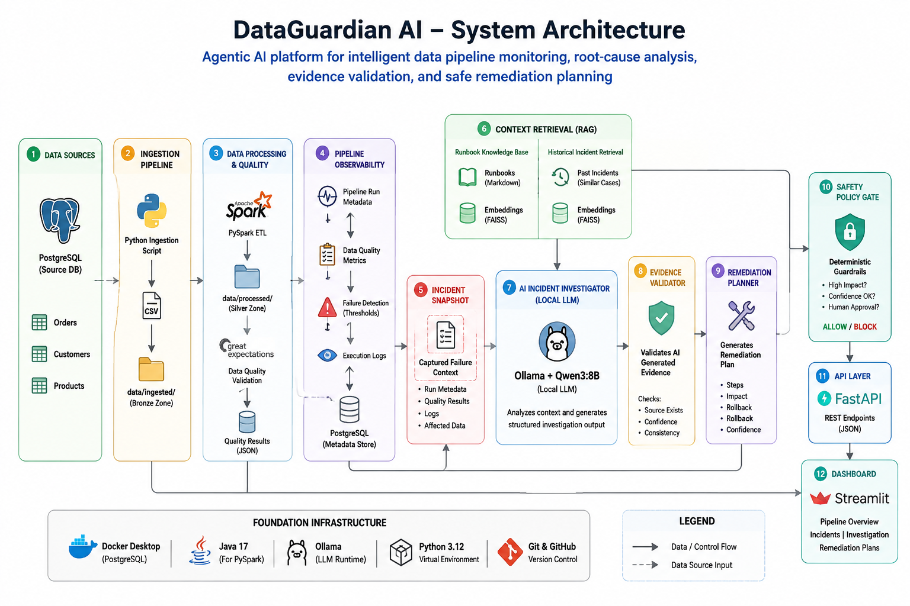
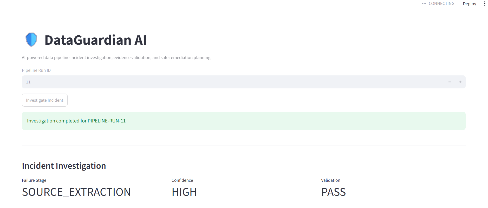
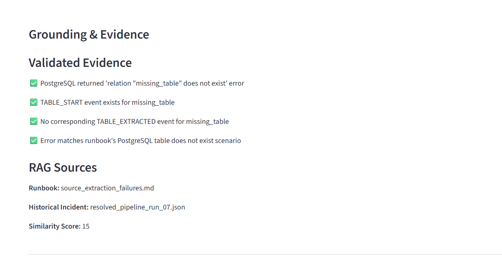
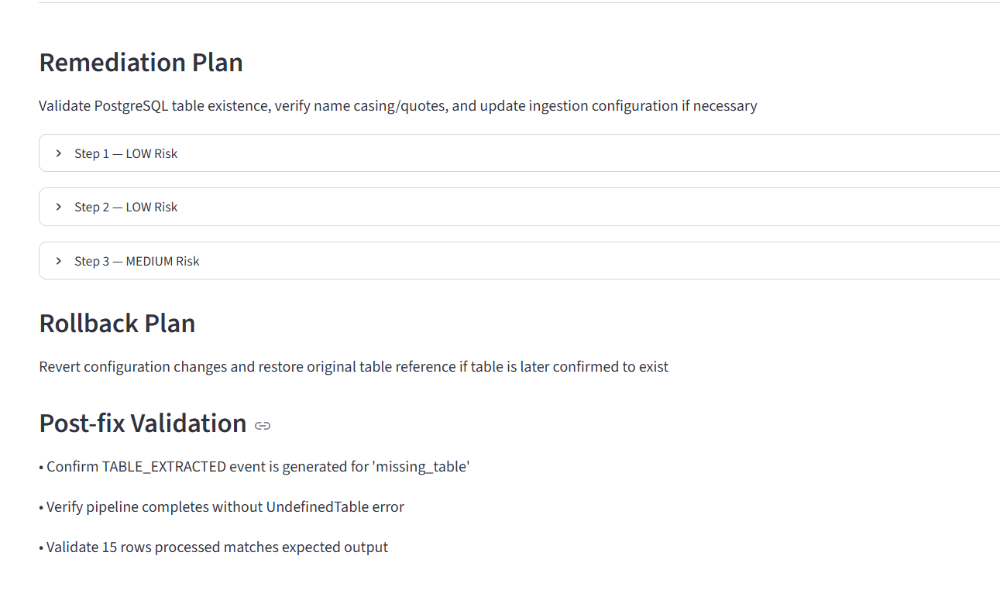
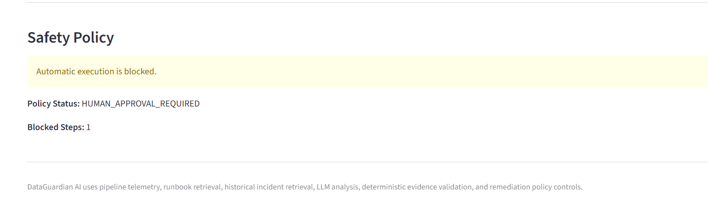

# DataGuardian AI

**Agentic AI platform for intelligent data pipeline monitoring, root-cause analysis, evidence validation, and safe remediation planning.**

DataGuardian AI is an end-to-end data reliability project that detects pipeline and data-quality failures, reconstructs execution history, retrieves relevant runbooks and similar historical incidents, uses a local LLM to investigate root cause, validates AI-generated evidence, and generates remediation plans behind deterministic safety controls.

---

## Why I Built This

Modern data platforms generate large volumes of pipeline logs, validation failures, and operational alerts. Engineers often spend significant time:

- identifying where a pipeline failed,

- searching logs and runbooks,

- comparing similar historical incidents,

- determining root cause,

- deciding whether a remediation is safe,

- and documenting the investigation.

DataGuardian AI demonstrates how AI can assist with this workflow **without blindly trusting or automatically executing LLM-generated actions**.

The system combines data engineering, observability, RAG, local LLM inference, deterministic guardrails, APIs, and a user-facing dashboard.

---

## Key Capabilities

- PostgreSQL source system running in Docker

- Python + SQLAlchemy ingestion pipeline

- PySpark transformation layer

- Great Expectations data-quality validation

- Structured pipeline run and event observability

- Automatic incident snapshot generation

- Local AI incident investigation using **Ollama + Qwen3 8B**

- Runbook retrieval for operational guidance

- Historical incident retrieval for similar resolved failures

- Structured RAG-grounded root-cause analysis

- Deterministic evidence validation to detect unsupported AI claims

- Validated investigation generation

- AI remediation planning

- Rule-based remediation policy gate

- Human approval requirement for risky actions

- FastAPI service layer

- Streamlit investigation dashboard

- Automated pytest coverage for guardrails and API behavior

- Reproducible PostgreSQL schema and seed setup

---

## Architecture


```text

&#x20;                   ┌──────────────────────┐

&#x20;                   │   PostgreSQL Source  │

&#x20;                   │      Dockerized      │

&#x20;                   └──────────┬───────────┘

&#x20;                              │

&#x20;                              â–¼

&#x20;                   ┌──────────────────────┐

&#x20;                   │  Python Ingestion    │

&#x20;                   │ SQLAlchemy + Pandas  │

&#x20;                   └──────────┬───────────┘

&#x20;                              │

&#x20;                              â–¼

&#x20;                   ┌──────────────────────┐

&#x20;                   │      Raw Layer       │

&#x20;                   └──────────┬───────────┘

&#x20;                              │

&#x20;                              â–¼

&#x20;                   ┌──────────────────────┐

&#x20;                   │ PySpark Transform    │

&#x20;                   └──────────┬───────────┘

&#x20;                              │

&#x20;                              â–¼

&#x20;                   ┌──────────────────────┐

&#x20;                   │ Great Expectations   │

&#x20;                   │ Data Quality Checks  │

&#x20;                   └──────────┬───────────┘

&#x20;                              │

&#x20;                              â–¼

&#x20;                ┌────────────────────────────┐

&#x20;                │ Pipeline Runs + Event Logs │

&#x20;                │   Observability Metadata   │

&#x20;                └─────────────┬──────────────┘

&#x20;                              │

&#x20;                              â–¼

&#x20;                   ┌──────────────────────┐

&#x20;                   │  Incident Snapshot   │

&#x20;                   └──────────┬───────────┘

&#x20;                              │

&#x20;             ┌────────────────┴────────────────┐

&#x20;             │                                 │

&#x20;             â–¼                                 â–¼

&#x20;   ┌────────────────────┐           ┌────────────────────┐

&#x20;   │ Runbook Retrieval  │           │ Historical Incident│

&#x20;   │        RAG         │           │     Retrieval      │

&#x20;   └──────────┬─────────┘           └──────────┬─────────┘

&#x20;              │                                │

&#x20;              └──────────────┬─────────────────┘

&#x20;                             â–¼

&#x20;                  ┌──────────────────────┐

&#x20;                  │  Ollama + Qwen3 8B   │

&#x20;                  │  AI Investigator     │

&#x20;                  └──────────┬───────────┘

&#x20;                             │

&#x20;                             â–¼

&#x20;                  ┌──────────────────────┐

&#x20;                  │ Evidence Validator   │

&#x20;                  │ Deterministic Rules  │

&#x20;                  └──────────┬───────────┘

&#x20;                             │

&#x20;                             â–¼

&#x20;                  ┌──────────────────────┐

&#x20;                  │ Validated Incident   │

&#x20;                  └──────────┬───────────┘

&#x20;                             │

&#x20;                             â–¼

&#x20;                  ┌──────────────────────┐

&#x20;                  │ Remediation Planner  │

&#x20;                  └──────────┬───────────┘

&#x20;                             │

&#x20;                             â–¼

&#x20;                  ┌──────────────────────┐

&#x20;                  │ Remediation Policy   │

&#x20;                  │ Safety / Approval    │

&#x20;                  └──────────┬───────────┘

&#x20;                             │

&#x20;                ┌────────────┴────────────┐

&#x20;                â–¼                         â–¼

&#x20;        ┌──────────────┐          ┌──────────────┐

&#x20;        │   FastAPI    │          │  Streamlit   │

&#x20;        │ Service API  │◄────────►│  Dashboard   │

&#x20;        └──────────────┘          └──────────────┘

```

---

## Example Incident

The demo scenario intentionally injects an invalid source table into the ingestion configuration:

```text

customers

products

orders

missing\_table   ← failure

order\_items

payments

```

DataGuardian records the execution trail:

```text

PIPELINE\_START

TABLE\_START customers

TABLE\_EXTRACTED customers

TABLE\_START products

TABLE\_EXTRACTED products

TABLE\_START orders

TABLE\_EXTRACTED orders

TABLE\_START missing\_table

PIPELINE\_ERROR

```

The resulting incident shows:

```text

Run ID:             11

Status:             FAILED

Rows processed:     15

Failure stage:      SOURCE\_EXTRACTION

Failed component:   missing\_table

```

---

## AI Investigation

DataGuardian retrieves:

1\. the current incident evidence,

2\. the most relevant operational runbook,

3\. a similar resolved historical incident.

The local Qwen3 model then produces a structured investigation similar to:

```json

{

&#x20; "incident\_id": "PIPELINE-RUN-11",

&#x20; "root\_cause": "PostgreSQL table 'missing\_table' does not exist in the source database",

&#x20; "failure\_stage": "SOURCE\_EXTRACTION",

&#x20; "failed\_component": "missing\_table",

&#x20; "confidence": "HIGH",

&#x20; "runbook\_used": "source\_extraction\_failures.md",

&#x20; "historical\_incident\_used": "resolved\_pipeline\_run\_07.json"

}

```

The historical incident is treated as **supporting precedent, not proof**. Current telemetry remains the source of truth.

---

## AI Guardrails

A major design goal of DataGuardian is avoiding blind trust in model output.

After the LLM generates an investigation, a deterministic evidence validator checks claims against the original telemetry.

For example, an unsupported AI statement such as:

```text

"No rows\_processed count for missing\_table"

```

is rejected if the incident does not contain evidence supporting that claim.

The output is separated into:

```text

Validated Evidence

Rejected Evidence

Validation Status

Safe for Remediation

```

---

## Safe Remediation

The remediation planner proposes actions but **never directly executes them**.

Example plan:

```text

1\. Verify source-table existence        → LOW risk

2\. Audit ingestion configuration       → MEDIUM risk

3\. Update ingestion configuration      → HIGH risk

```

A separate deterministic policy engine evaluates the plan.

Example decision:

```json

{

&#x20; "policy\_status": "HUMAN\_APPROVAL\_REQUIRED",

&#x20; "automatic\_execution\_allowed": false,

&#x20; "blocked\_step\_count": 1

}

```

Read-only diagnostic steps may be allowed for review, while configuration or schema-changing operations are blocked until human approval.

---

## Dashboard

The Streamlit dashboard provides a visual workflow for investigating a pipeline run.

Users can enter a run ID and view:

- failure stage,

- failed component,

- root cause,

- AI confidence,

- validated and rejected evidence,

- retrieved runbook,

- similar historical incident,

- remediation plan,

- rollback guidance,

- post-fix validation,

- policy status,

- blocked remediation steps,

- and human approval requirements.

---

### Incident Investigation Overview



### Grounding & Evidence



### Remediation Plan



### Safety Policy



## API

DataGuardian exposes a FastAPI service.

### Health Check

```http

GET /health

```

Example response:

```json

{

&#x20; "status": "healthy"

}

```

### Investigate Incident

```http

POST /investigate

```

Request:

```json

{

&#x20; "run\_id": 11

}

```

The endpoint executes the full workflow and returns:

```text

investigation

validation

remediation

policy

```

Interactive Swagger documentation is available locally at:

```text

http://127.0.0.1:8000/docs

```

---

## Tech Stack

| Layer | Technology |

|---|---|

| Language | Python 3.12 |

| Source Database | PostgreSQL 16 |

| Containers | Docker / Docker Compose |

| Database Access | SQLAlchemy, psycopg2 |

| Data Processing | Pandas, PySpark |

| Data Quality | Great Expectations |

| Local LLM | Qwen3 8B |

| LLM Runtime | Ollama |

| Structured AI Output | Pydantic |

| RAG | Runbook + historical incident retrieval |

| API | FastAPI |

| API Server | Uvicorn |

| UI | Streamlit |

| Testing | pytest |

| Version Control | Git / GitHub |

---

## Project Structure

```text

dataguardian-ai/

│

├── api/

│   └── main.py

│

├── database/

│   ├── schema.sql

│   └── seed.sql

│

├── dataguardian/

│   ├── agents/

│   │   ├── incident\_investigator.py

│   │   ├── investigation\_schema.py

│   │   ├── evidence\_validator.py

│   │   ├── validated\_investigation\_builder.py

│   │   ├── remediation\_planner.py

│   │   ├── remediation\_policy.py

│   │   └── workflow\_orchestrator.py

│   │

│   ├── rag/

│   │   ├── runbook\_retriever.py

│   │   └── historical\_incident\_retriever.py

│   │

│   └── tools/

│       └── build\_run\_incident.py

│

├── incidents/

│   ├── historical/

│   ├── investigations/

│   ├── remediation\_plans/

│   ├── remediation\_policy/

│   ├── runbooks/

│   ├── validated/

│   └── validations/

│

├── pipelines/

│   ├── ingestion/

│   ├── quality/

│   └── transformations/

│

├── tests/

│   ├── test\_api.py

│   └── test\_guardrails.py

│

├── ui/

│   └── app.py

│

├── .env.example

├── docker-compose.yml

├── requirements.txt

└── README.md

```

---

## Running Locally

### Prerequisites

Install:

- Python 3.12

- Docker Desktop

- Java 17

- Ollama

- Git

Clone the repository:

```bash

git clone https://github.com/sushmithasushmi/dataguardian-ai.git

cd dataguardian-ai

```

Create the Python environment:

```bash

python -m venv .venv

```

On Windows:

```powershell

.\\.venv\\Scripts\\Activate.ps1

```

Install dependencies:

```bash

pip install -r requirements.txt

```

---

## Environment Configuration

Copy:

```text

.env.example

```

to:

```text

.env

```

Example:

```text

POSTGRES\_DB=dataguardian

POSTGRES\_USER=dataguardian\_user

POSTGRES\_PASSWORD=your\_local\_password

```

Do not commit `.env`.

---

## Start PostgreSQL

```bash

docker compose up -d

```

On a fresh Docker volume, PostgreSQL automatically executes:

```text

database/schema.sql

database/seed.sql

```

This creates the source tables, observability tables, and starter dataset.

---

## Install the Local AI Model

Pull Qwen3:

```bash

ollama pull qwen3:8b

```

Verify:

```bash

ollama list

```

Ollama must be running before an AI investigation is executed.

---

## Run the Pipeline

Activate the virtual environment and run:

```bash

python pipelines/ingestion/extract\_postgres.py

```

Then run the transformation:

```bash

python pipelines/transformations/transform\_orders.py

```

---

## Run the AI Workflow

```bash

python dataguardian/agents/workflow\_orchestrator.py incidents/historical/pipeline\_run\_11\_incident.json

```

The orchestrator executes:

```text

AI investigation

→ evidence validation

→ validated investigation

→ remediation planning

→ remediation policy evaluation

```

---

## Start FastAPI

```bash

python -m uvicorn api.main:app --reload

```

Open:

```text

http://127.0.0.1:8000/docs

```

---

## Start Streamlit

In a second terminal:

```bash

python -m streamlit run ui/app.py

```

Open:

```text

http://localhost:8501

```

Use demo Run ID:

```text

11

```

---

## Run Tests

```bash

python -m pytest tests -v

```

The current test suite verifies:

- supported evidence passes validation,

- unsupported evidence is flagged,

- risky remediation is blocked,

- read-only checks are allowed for review,

- FastAPI health behavior,

- root API behavior,

- unknown incidents return 404.

---

## Design Principles

### Evidence Before AI

Pipeline telemetry is the source of truth. LLM output is treated as an interpretation of evidence, not authoritative fact.

### RAG as Supporting Context

Runbooks and historical incidents improve investigation quality but are never allowed to override current incident evidence.

### Deterministic Safety Controls

The LLM does not decide whether its own remediation plan is safe. A separate rule-based policy layer evaluates potentially state-changing actions.

### Human-in-the-Loop Remediation

High-risk configuration or schema changes require explicit human approval.

### Local-First AI

The project uses Ollama and Qwen3 locally, allowing development without paid API dependency and keeping incident data on the local machine.

---

## Current Limitations

This project is currently a local portfolio implementation rather than a production deployment.

Current limitations include:

- keyword-based retrieval rather than embedding/vector retrieval,

- local single-node execution,

- limited historical incident corpus,

- synthetic/demo source data,

- no authentication or authorization layer,

- no distributed orchestration deployment,

- remediation actions are proposed but intentionally not executed,

- PySpark local Windows execution uses a Pandas write fallback for the processed demo output.

---

## Future Improvements

Planned extensions include:

- embedding-based vector retrieval,

- larger historical incident corpus,

- Airflow orchestration,

- incident severity scoring,

- lineage-aware impact analysis,

- SLA and anomaly detection,

- structured audit history,

- human approval workflow,

- CI/CD with GitHub Actions,

- cloud deployment,

- authentication and RBAC,

- multi-pipeline support,

- agent evaluation benchmarks,

- observability metrics and tracing.

---

## What This Project Demonstrates

DataGuardian AI brings together:

**Data Engineering**

- PostgreSQL

- SQL

- Python

- PySpark

- ETL

- data quality

- observability

- Docker

**AI Engineering**

- local LLM inference

- structured outputs

- RAG

- historical memory

- evidence grounding

- agentic workflows

- hallucination guardrails

- remediation planning

**Software Engineering**

- FastAPI

- Streamlit

- Pydantic

- pytest

- modular architecture

- reproducible environments

- Git/GitHub

**AI Safety for Operations**

- deterministic policy enforcement

- unsupported-evidence rejection

- read-only vs state-changing action classification

- human approval requirements

- automatic execution blocking

---

## Repository

This project is actively developed as a portfolio demonstration of how AI can assist data engineers with pipeline reliability while preserving deterministic controls around operational decisions.
